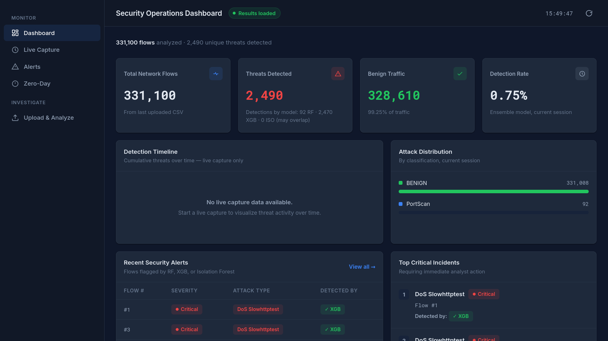
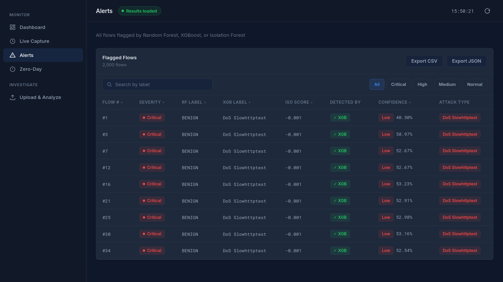
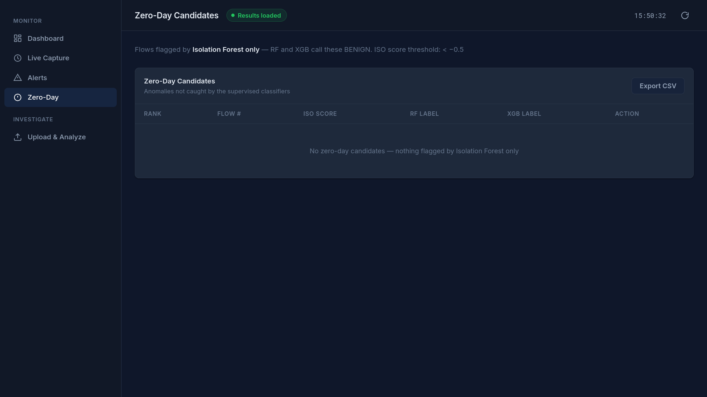
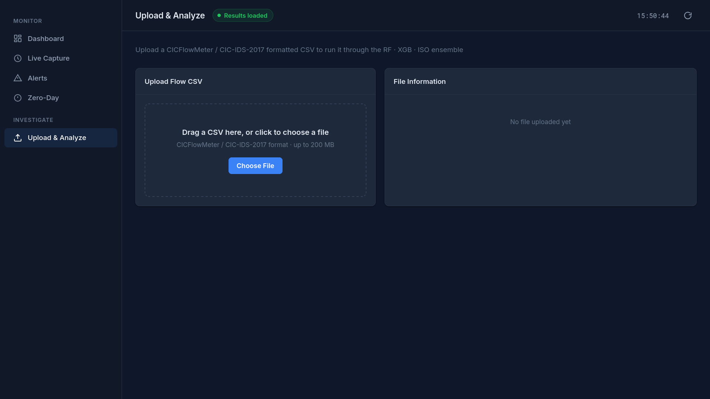
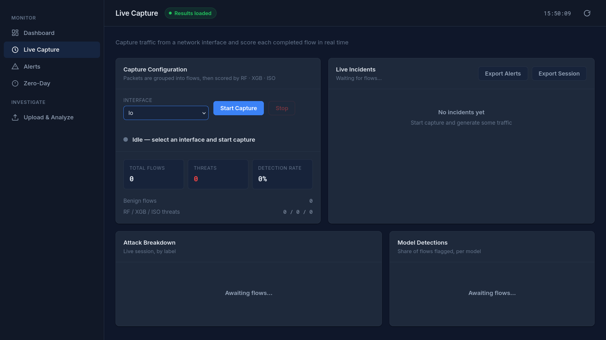
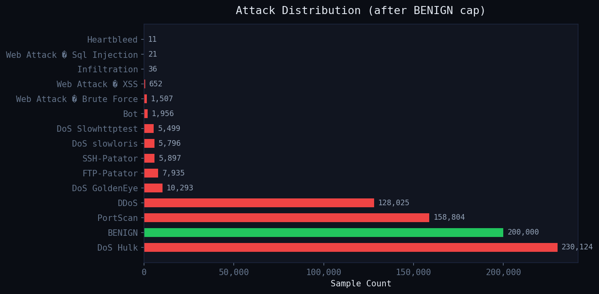
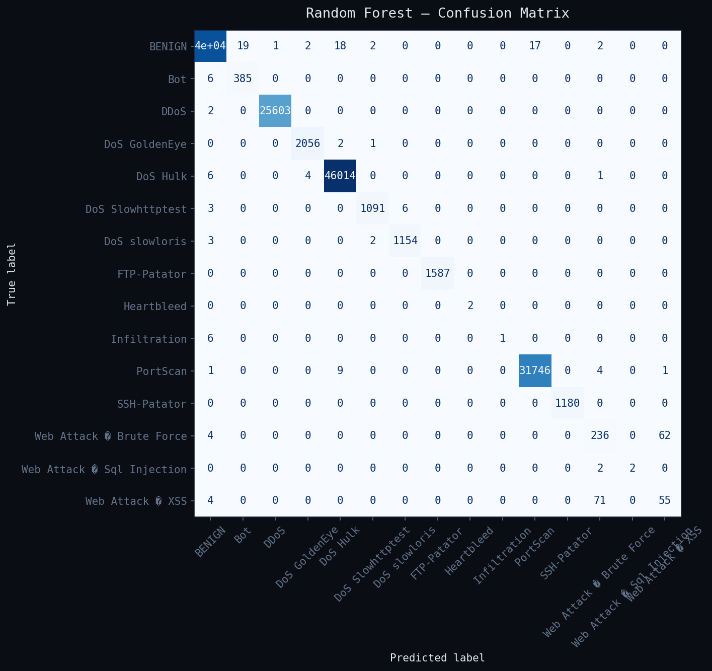
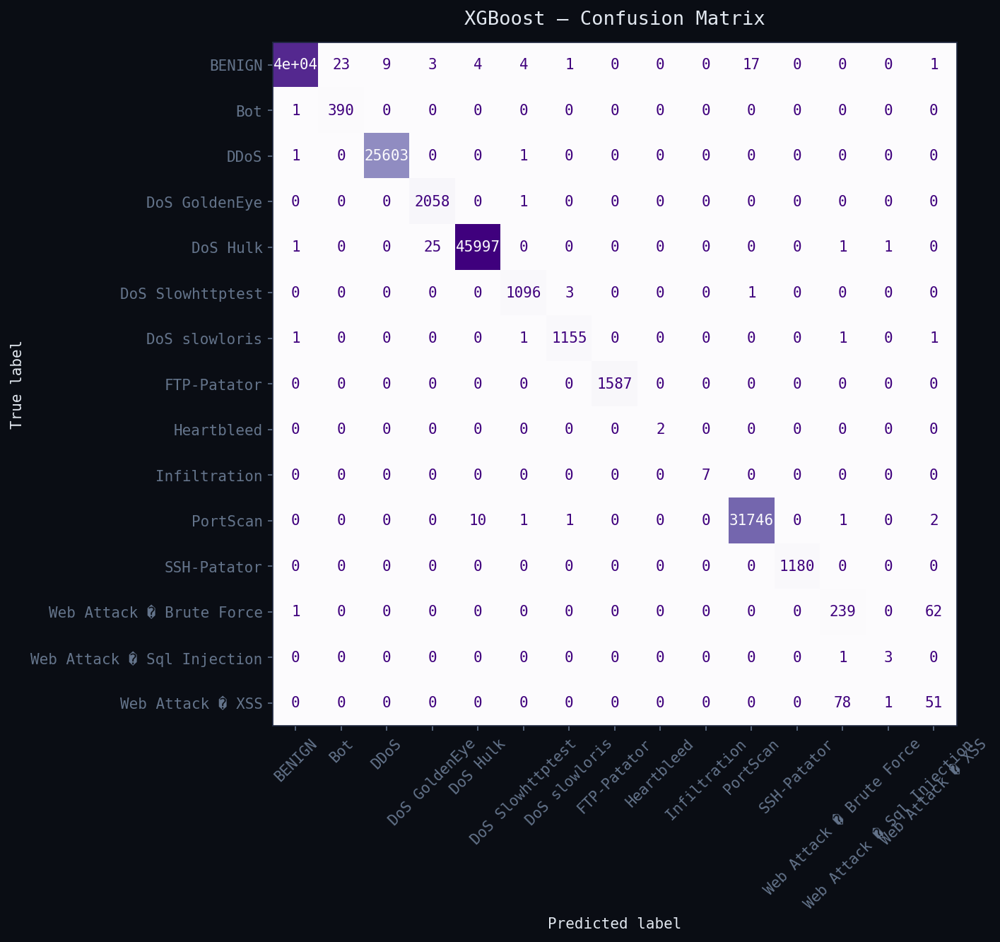
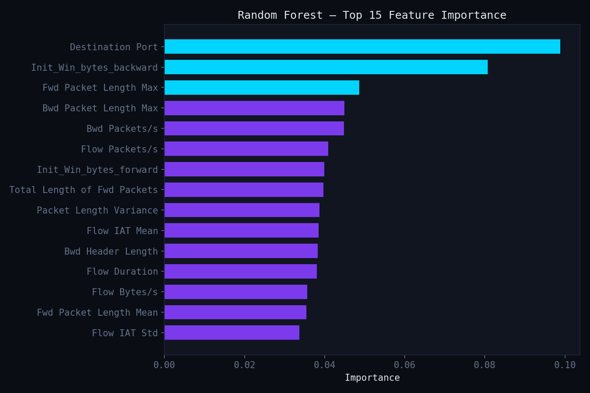
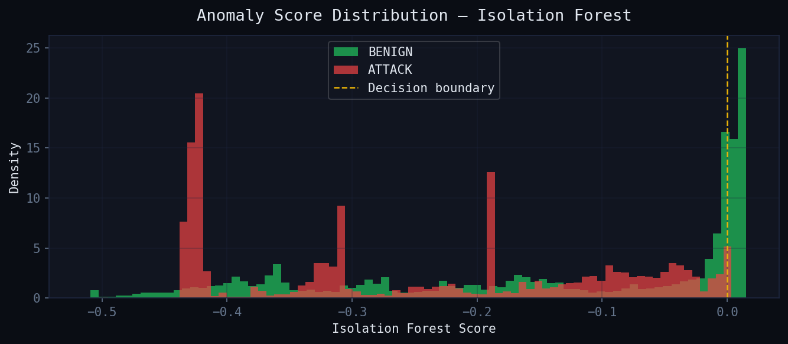

# AI-Powered IDS

An end-to-end **AI-Powered Network Intrusion Detection System** that combines supervised machine learning and anomaly detection to analyze network flows, classify known attacks, identify suspicious unknown behavior, and present security events through a SOC-inspired dashboard.

The system is built using the **CICIDS2017 dataset** and integrates **Random Forest, XGBoost, and Isolation Forest** into a unified detection pipeline. It supports both CSV-based traffic analysis and an experimental live network capture pipeline.

> **Note:** The live traffic analysis module is implemented but has not been comprehensively validated because of virtual machine and network environment limitations.

---

## Overview

Traditional signature-based intrusion detection systems are effective at identifying known attack patterns but can struggle with previously unseen behavior.

This project explores a hybrid machine learning approach:

* **Random Forest** for multiclass network attack classification
* **XGBoost** for multiclass network attack classification
* **Isolation Forest** for anomaly detection and zero-day candidate identification

The three models are integrated into a single detection pipeline and connected to a web-based security operations dashboard.

The project focuses not only on training machine learning models but also on building an end-to-end system around them, including preprocessing, prediction, traffic analysis, alert generation, visualization, reporting, and experimental live network monitoring.

---

## Screenshots

### Security Operations Dashboard

The main dashboard provides an overview of analyzed network flows, detected threats, benign traffic, detection rate, attack distribution, recent security alerts, and critical incidents.

<!-- Replace the path below if your screenshot filename is different -->





---

### Alerts & Threat Investigation

Detected flows are presented through a searchable and filterable alert interface containing model predictions, severity, attack type, confidence, and Isolation Forest anomaly scores.





---

### Zero-Day Candidates

The Zero-Day view displays anomalous flows identified by Isolation Forest that were classified as benign by the supervised models.





---

### CSV Traffic Analysis

Users can upload CICFlowMeter/CICIDS2017-formatted network flow CSV files for analysis by the complete machine learning pipeline.





---

### Experimental Live Capture

The live capture interface allows network interface selection, flow monitoring, model-based traffic analysis, incident generation, and session export.





---

## System Architecture

```text
                         Network Traffic
                                │
                ┌───────────────┴───────────────┐
                │                               │
         CSV Flow Upload                Live Network Capture
                │                         (Experimental)
                │                               │
                └───────────────┬───────────────┘
                                │
                                ▼
                       Feature Extraction
                                │
                                ▼
                         Preprocessing
                                │
              ┌─────────────────┼─────────────────┐
              │                 │                 │
              ▼                 ▼                 ▼
       Random Forest         XGBoost       Isolation Forest
              │                 │                 │
              │                 │                 │
        Known Attack      Known Attack        Anomaly
       Classification    Classification       Detection
              │                 │                 │
              └─────────────────┼─────────────────┘
                                │
                                ▼
                        Detection Pipeline
                                │
                                ▼
                     Security Event Analysis
                                │
              ┌─────────────────┼─────────────────┐
              │                 │                 │
              ▼                 ▼                 ▼
          Dashboard           Alerts        Zero-Day View
                                │
                                ▼
                         CSV/JSON Export
```

---

## Machine Learning Pipeline

### Random Forest

Random Forest is used as one of the supervised multiclass classifiers.

The model learns patterns from labeled CICIDS2017 network traffic and predicts whether a flow is benign or belongs to a known attack category.

Random Forest was selected because of its effectiveness with structured tabular data, ability to model nonlinear relationships, and support for feature importance analysis.

---

### XGBoost

XGBoost provides a second supervised classification model.

Like Random Forest, it performs multiclass classification across the attack categories present in the processed CICIDS2017 dataset.

Using two supervised models makes it possible to compare predictions and analyze differences in model behavior.

---

### Isolation Forest

Isolation Forest is used as the anomaly detection component of the system.

Unlike Random Forest and XGBoost, Isolation Forest does not perform multiclass attack classification. Instead, it assigns anomaly scores to network flows.

This component is used to identify suspicious flows that may not be recognized by the supervised classifiers.

The system treats flows detected only by Isolation Forest as **zero-day candidates** for further security investigation.

> A zero-day candidate in this project represents anomalous network behavior requiring investigation. It does not automatically prove the existence of a real zero-day vulnerability.

---

## Ensemble Detection Logic

The models are combined into a unified detection pipeline.

A network flow can be flagged when:

```text
Random Forest predicts ATTACK

                OR

XGBoost predicts ATTACK

                OR

Isolation Forest identifies anomalous behavior
```

Conceptually:

```text
suspicious =
    RF prediction != BENIGN
    OR
    XGB prediction != BENIGN
    OR
    Isolation Forest score < threshold
```

This architecture combines:

* supervised attack classification
* model comparison
* anomaly detection
* security alert generation

The system also preserves model-specific predictions and anomaly scores for further analysis.

---

## Dataset

The project was developed using the **CICIDS2017 dataset**.

CICIDS2017 contains benign network activity and multiple attack categories represented as network flows.

The processed dataset used in this project contains attack categories including:

* BENIGN
* Bot
* DDoS
* DoS GoldenEye
* DoS Hulk
* DoS Slowhttptest
* DoS slowloris
* FTP-Patator
* Heartbleed
* Infiltration
* PortScan
* SSH-Patator
* Web Attack – Brute Force
* Web Attack – SQL Injection
* Web Attack – XSS

### Dataset Distribution

The original data contains significant class imbalance. Some attack classes contain hundreds of thousands of samples, while rare categories contain only a small number of examples.



This imbalance is an important challenge when evaluating intrusion detection models because high overall accuracy does not necessarily indicate equally strong performance across every attack category.

---

## Model Evaluation

Evaluating an Intrusion Detection System using accuracy alone can be misleading, especially when working with an imbalanced dataset such as CICIDS2017.

For this reason, the supervised models were evaluated using multiple metrics:

- Accuracy
- Macro Precision
- Macro Recall
- Macro F1-Score
- False Positive Rate (FPR)
- Per-class classification performance
- Confusion matrices

### Supervised Model Performance

| Model | Accuracy | Macro Precision | Macro Recall | Macro F1-Score | FPR |
|---|---:|---:|---:|---:|---:|
| Random Forest | 99.83% | **94.34%** | 85.44% | 87.18% | **0.15%** |
| XGBoost | 99.83% | 91.32% | **92.81%** | **91.99%** | 0.16% |

Both Random Forest and XGBoost achieved an overall accuracy of approximately **99.83%** with very low false positive rates.

However, accuracy alone does not provide a complete picture of model performance. The CICIDS2017 dataset is highly imbalanced, with significantly more samples for some traffic classes than others.

XGBoost achieved a higher **Macro Recall of 92.81%** and **Macro F1-Score of 91.99%**, indicating more balanced performance across the different traffic classes.

Random Forest achieved a higher **Macro Precision of 94.34%** and a slightly lower **False Positive Rate of 0.15%**.

These results demonstrate why multiple evaluation metrics are important when evaluating machine learning models for network intrusion detection.

---

### Random Forest Evaluation

The Random Forest classifier achieved:

| Metric | Result |
|---|---:|
| Accuracy | 99.83% |
| Macro Precision | 94.34% |
| Macro Recall | 85.44% |
| Macro F1-Score | 87.18% |
| False Positive Rate | 0.15% |

The model achieved strong overall classification performance and maintained a very low false positive rate.

However, the per-class evaluation and confusion matrix demonstrate that some minority attack classes are more difficult to classify reliably because of the significant class imbalance in the CICIDS2017 dataset.



---

### XGBoost Evaluation

The XGBoost classifier achieved:

| Metric | Result |
|---|---:|
| Accuracy | 99.83% |
| Macro Precision | 91.32% |
| Macro Recall | 92.81% |
| Macro F1-Score | 91.99% |
| False Positive Rate | 0.16% |

XGBoost achieved the strongest Macro F1-Score and Macro Recall of the two supervised models.

The higher Macro Recall indicates that XGBoost was more effective at detecting samples across the different traffic classes, including classes with fewer examples.



---

## Feature Importance Analysis

Random Forest feature importance was analyzed to better understand which network flow characteristics contributed most strongly to classification decisions.



Some of the most influential network flow features identified during model evaluation include:

- Destination Port
- Initial backward TCP window bytes
- Maximum forward packet length
- Maximum backward packet length
- Backward packets per second
- Flow packets per second
- Initial forward TCP window bytes
- Total length of forward packets
- Packet length variance
- Flow inter-arrival time
- Flow duration
- Flow bytes per second

Feature importance analysis provides additional insight into the network traffic characteristics used by the model when distinguishing between benign and malicious flows.

---

## Isolation Forest Evaluation

Isolation Forest is used as the anomaly detection component of the system.

Unlike Random Forest and XGBoost, Isolation Forest is not used for multiclass attack classification. Instead, it identifies network flows that differ from learned normal traffic behavior.

### Isolation Forest Results

| Metric | Result |
|---|---:|
| Attack Recall | 99.05% |
| Attack Precision | 80.01% |
| False Positive Rate | 68.88% |
| True Positives | 110,251 |
| False Positives | 27,552 |
| True Negatives | 12,448 |
| False Negatives | 1,061 |

The Isolation Forest model achieved a high **Attack Recall of 99.05%**, meaning that it identified a large proportion of malicious traffic as anomalous.

However, the model also produced a **False Positive Rate of 68.88%**.

This demonstrates an important challenge in anomaly-based intrusion detection: increasing sensitivity to unusual behavior can also result in legitimate network traffic being incorrectly flagged as suspicious.



Because of this limitation, Isolation Forest predictions are not treated as confirmed attacks.

Instead, the model is used as an additional anomaly detection layer within the IDS pipeline.

Flows identified only by Isolation Forest are presented as **zero-day candidates** for further security investigation.

> **Important:** A zero-day candidate in this project represents anomalous network behavior that requires further investigation. It does not represent a confirmed zero-day vulnerability.

---

## Model Evaluation Summary

The evaluation results demonstrate the different roles of the three machine learning models within the system:

- **Random Forest** provides strong multiclass classification performance with high precision and a low false positive rate.
- **XGBoost** achieves stronger overall performance across attack classes based on Macro Recall and Macro F1-Score.
- **Isolation Forest** provides high anomaly detection sensitivity but also generates a significant number of false positives.

Rather than relying on a single model, the project combines supervised classification and anomaly detection to provide multiple perspectives on network traffic.

The supervised models focus on identifying known attack patterns, while Isolation Forest acts as an experimental anomaly detection layer for identifying unusual traffic that may require further investigation.

## SOC-Inspired Dashboard

The project includes a web-based dashboard inspired by Security Operations Center workflows.

### Dashboard Overview

The main dashboard displays:

* total network flows
* detected threats
* benign traffic
* detection rate
* attack distribution
* recent security alerts
* critical incidents
* model responsible for detection

### Alert Investigation

The Alerts interface provides:

* flow number
* severity
* Random Forest prediction
* XGBoost prediction
* Isolation Forest score
* detection source
* prediction confidence
* attack classification
* search
* severity filters

### Zero-Day Candidate Analysis

The Zero-Day interface focuses on flows that:

```text
Random Forest → BENIGN

XGBoost → BENIGN

Isolation Forest → ANOMALY
```

These flows are separated from known attack classifications and presented as candidates for additional investigation.

---

## CSV Traffic Analysis

The application supports the analysis of CICFlowMeter/CICIDS2017-compatible CSV files.

The general workflow is:

```text
Upload CSV
    │
    ▼
Validate Input
    │
    ▼
Preprocess Network Features
    │
    ▼
Run Random Forest
    │
    ▼
Run XGBoost
    │
    ▼
Calculate Isolation Forest Scores
    │
    ▼
Combine Detection Results
    │
    ▼
Generate Dashboard Statistics
    │
    ▼
Investigate and Export Results
```

Large datasets are processed in chunks to reduce memory pressure during prediction.

---

## Experimental Live Network Detection

The project also contains a live network traffic analysis pipeline.

The implementation is designed to:

* select a network interface
* capture TCP and UDP packets
* group packets into bidirectional flows
* extract flow-level features
* generate CICFlowMeter-compatible feature representations
* run flows through the trained models
* generate security incidents
* calculate severity levels
* display live statistics
* export alerts
* export session data

### Current Limitation

The live detection pipeline has been implemented but has not been comprehensively tested because of limitations involving the virtual machine and network environment used during development.

Therefore, this component should currently be considered **experimental** rather than production-ready.

---

## Technology Stack

| Area                 | Technologies           |
| -------------------- | ---------------------- |
| Programming Language | Python                 |
| Machine Learning     | Scikit-learn, XGBoost  |
| Supervised Models    | Random Forest, XGBoost |
| Anomaly Detection    | Isolation Forest       |
| Data Processing      | Pandas, NumPy          |
| Backend              | Flask                  |
| Frontend             | HTML, CSS, JavaScript  |
| Network Capture      | PyShark                |
| Dataset              | CICIDS2017             |
| Visualization        | Matplotlib             |
| Version Control      | Git, GitHub            |

---

## Project Features

* Hybrid machine learning intrusion detection
* Random Forest multiclass classification
* XGBoost multiclass classification
* Isolation Forest anomaly detection
* CICIDS2017 network flow analysis
* CSV traffic upload
* Experimental live traffic capture
* Flow-based network analysis
* SOC-inspired dashboard
* Attack distribution visualization
* Model-specific predictions
* Confidence scores
* Anomaly scores
* Severity classification
* Security alert investigation
* Zero-day candidate identification
* Search and filtering
* CSV export
* JSON export
* Model evaluation visualizations
* Feature importance analysis

---

## Installation

### Clone the Repository

```bash
git clone https://github.com/Rohit820911/AI_POWERED_IDS.git
cd AI_POWERED_IDS
```

### Create a Virtual Environment

Linux/macOS:

```bash
python -m venv venv
source venv/bin/activate
```

Windows:

```bash
python -m venv venv
venv\Scripts\activate
```

### Install Dependencies

```bash
pip install -r requirements.txt
```

### Run the Application

```bash
python app.py
```

Open the local address displayed in the terminal.


## Limitations

The current project has several limitations:

* CICIDS2017 is an older benchmark dataset and does not fully represent modern production network environments.
* The dataset contains significant class imbalance.
* Rare attack categories have substantially fewer training examples.
* Strong overall model performance does not guarantee equally strong detection for every attack class.
* Isolation Forest anomalies are candidates for investigation, not confirmed zero-day attacks.
* The live capture implementation requires additional testing and validation.
* CICFlowMeter compatibility and real-time feature extraction require careful validation before production deployment.
* The system is intended as an educational and portfolio project rather than a replacement for production IDS solutions.

---

## Future Improvements

Potential future improvements include:

* Comprehensive live traffic testing
* Improved real-time feature extraction
* Testing on additional intrusion detection datasets
* Better handling of minority attack classes
* Advanced feature selection
* Model explainability using SHAP
* Autoencoder-based anomaly detection
* Concept drift detection
* Threat intelligence integration
* Zeek integration
* Suricata integration
* SIEM integration
* Docker deployment
* REST API support
* Model monitoring
* Production-oriented logging and testing

---

## What I Learned

Building this project provided practical experience across both machine learning and cybersecurity.

The development process involved learning and implementing:

* network traffic analysis
* flow-based intrusion detection
* CICIDS2017 preprocessing
* feature selection
* imbalanced dataset analysis
* multiclass classification
* anomaly detection
* model evaluation
* confusion matrix interpretation
* feature importance analysis
* ensemble detection logic
* Flask backend development
* dashboard development
* network packet capture
* live flow generation
* security alert presentation
* ML model integration into an end-to-end application

---

## Use of AI Tools

AI tools were used as development and learning assistants throughout the project.

* **Claude** was used to assist with machine learning model development and coding.
* **Gemini Deep Research** was used for research related to AI-powered intrusion detection systems, networking concepts, cybersecurity concepts, and system architecture.
* **ChatGPT** was used for technical explanations, debugging assistance, project improvement suggestions, documentation, and README development.

AI-generated suggestions were reviewed, tested, modified, and integrated as part of the learning and development process.

---

## Disclaimer

This project was developed for **educational, research, and portfolio purposes**.

It is not intended to replace a production-grade Intrusion Detection System or professional security monitoring platform.

The terms **anomaly** and **zero-day candidate** refer to suspicious behavior identified by the machine learning pipeline and should not be interpreted as confirmed zero-day vulnerabilities.

---

## Author

**Rohit**

B.Tech — Artificial Intelligence & Data Science

Interested in Cybersecurity, Machine Learning, Network Security, and AI-based Threat Detection.

---

## Contributions

Suggestions, bug reports, and contributions are welcome.

Feel free to open an issue or submit a pull request.

---

## License

This project is intended for educational and research purposes.
